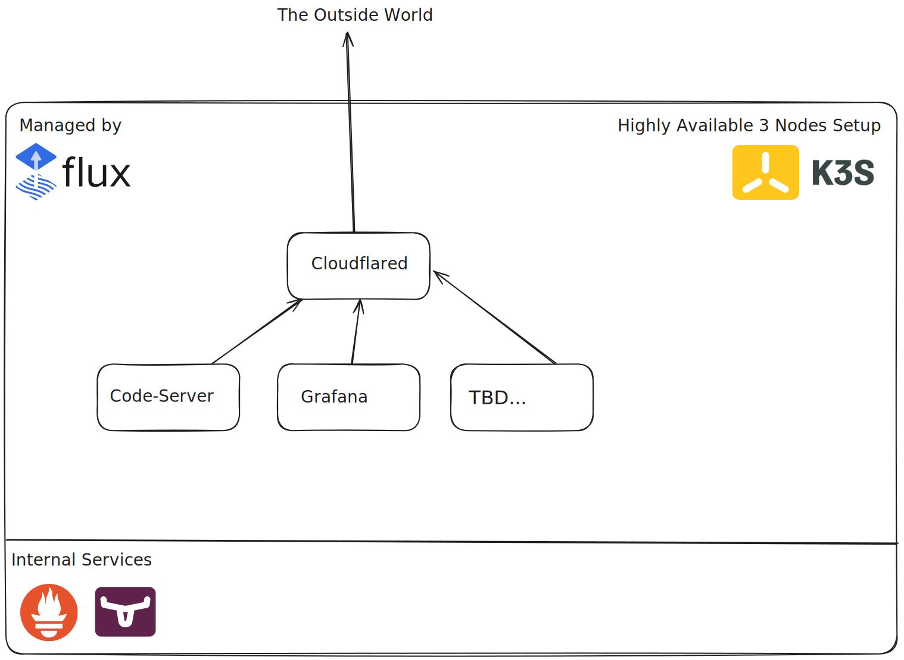

# Homelab Stuff 

A mix of Docker and Kubernetes deployments for learning and breaking things.

## Nodes

### 1x Kamrui Mini PC
- 6C/12T AMD Ryzen 5 5500U
- 16GB DDR4 RAM
- Rocky Linux 9.5

### 2x Dell Optiplex 7060
- 6C/6T Intel Core i5 8500T
- 32GB DDR4 RAM
- Rocky Linux 9.5

## Deployment

A highly available 3 node `k3s` cluster is primarily used for exploring `Kubernetes` features such as ingress, stateful deployments, persistent storage management, etc.

The stuff I mainly use is orchestrated using Docker compose since it is easier to maintain and debug.

## Applications

- Pi-hole
    - `DNS` and `DHCP` server.
- Prometheus
- Grafana